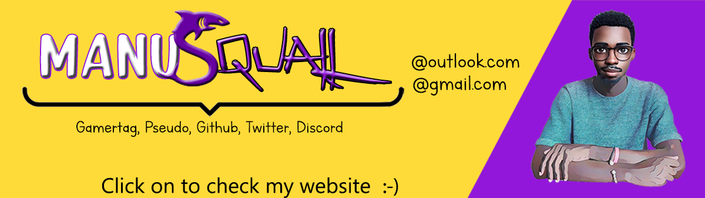

<!-- Repository git : https://github.com/ManuSquall/ -->
<h1 id="project-title">Project Title</h1>
<!-- Description -->
<!-- 

 -->
<h2 id="-context-">💡 Context 💡</h2>
<!-- Why am i making this -->
<h2 id="-tools-used-">⚒ Tools used 🛠</h2>
<!-- Packages, external librairies, IDE, utilitaries used -->
<!-- * [VS Code](https://code.visualstudio.com/) -->
<!-- * [Visual Studio](https://visualstudio.microsoft.com/fr/downloads/) -->
<h2 id="prerequisites">📌 Prerequisites 📌</h2>
<blockquote>

Node version 10.22.1

</blockquote>
<h2 id="-how-does-it-work-">🎮 How does it work 🎮</h2>
<!-- What we have to do to make it work/run -->

In the project directory, you can run:

<h2 id="-output-">💻 Output 💻</h2>
<!-- What the result is supposed to be -->
<!-- screenshot result in a readme folder

-->
<h2 id="-about-authors-contributors-">👥 About Authors / Contributors 👥</h2>

<a href="https://github.com/ManuSquall">ManuSquall</a>

<h2 id="-license-">📜 License 📜</h2>
<!-- 
This project is licensed under the <a href="https://creativecommons.org/">CC0 1.0 Universal</a> Creative Commons License.
 -->
<!-- This project is licensed under the [MIT License](https://en.wikipedia.org/wiki/MIT_License). -->
<h2 id="-acknowledgments-">🔍 Acknowledgments 🔍</h2>
<!-- inspiration, research stuff -->

<em>
</em>

<h3 id="sharing-is-caring-">Sharing is caring! 💜</h3>
